config的配置的信息：https://github.com/iio97/lagou-config

视频演示地址：https://github.com/iio97/lagou-config/blob/master/vido.mp4

static静态文件：static

nginx配置文件：nginx.conf

### 1.用户访问到登录面，在登录⻚页⾯面中有注册新账号功能

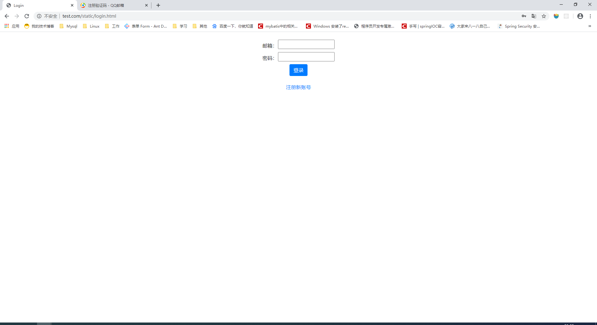

### 2.在注册面，需要⽤户输⼊入邮箱地址、密码、确认密码，然后点击”获取验证码“，系统会⽣生成验证码并向所输⼊入的邮箱地址发送该验证码，⽤用户拿到邮箱中的验证码输⼊入后完成注册

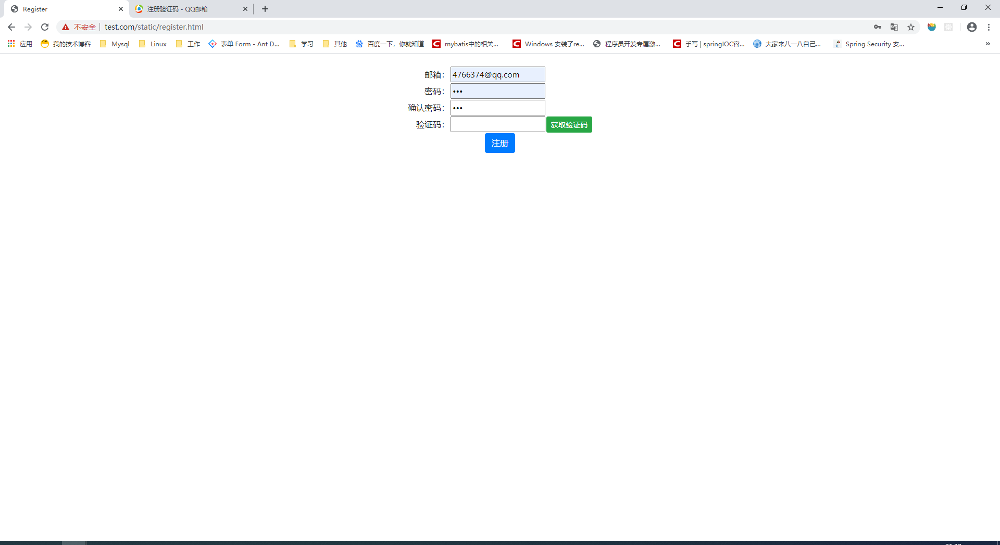
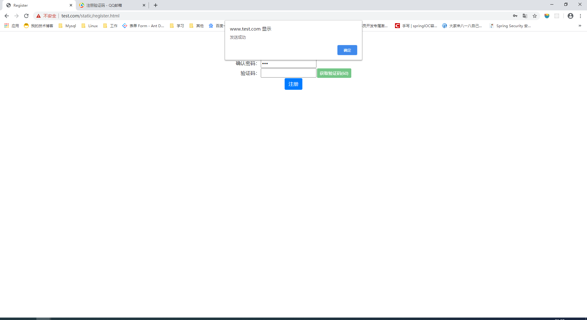

#### 相关代码

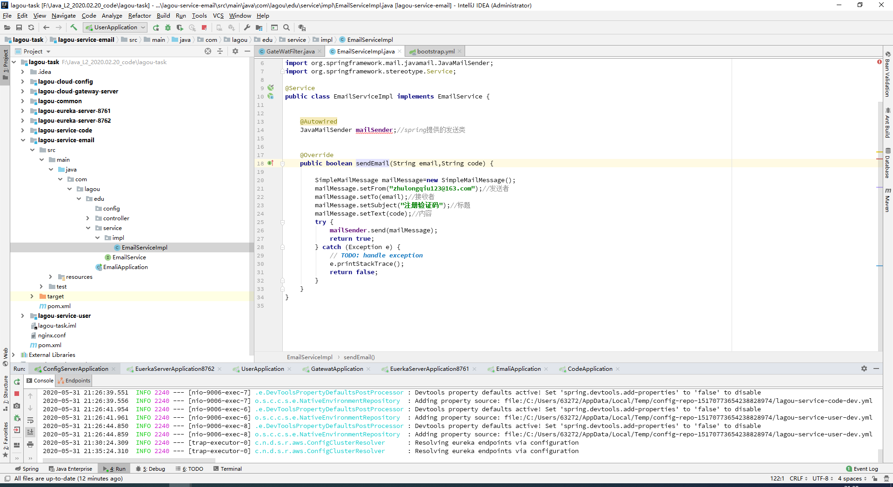
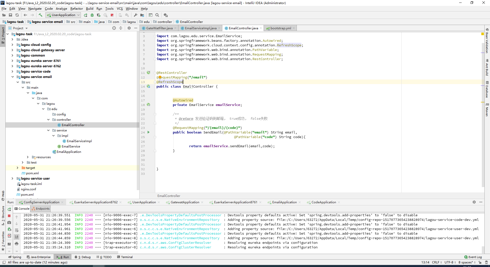
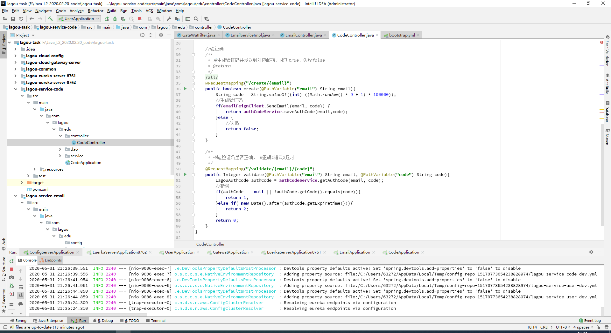
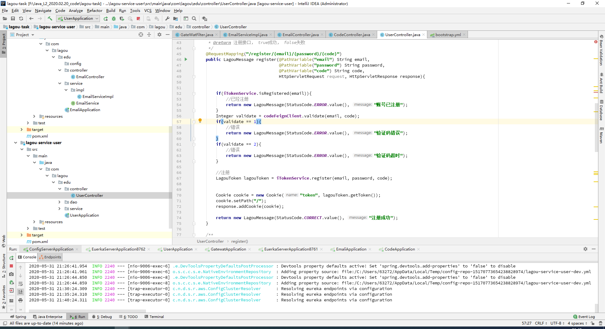

### A：一分钟内只允许获取⼀一次验证码（前端Js控制即可），验证码为随机⽣生成的6位数字， 10分钟内有效， 验证码存储到mysql数据库中（因为⼤大家未系统学习Redis，所以此处令牌存⼊入数据库即可） ；

#### 相关代码

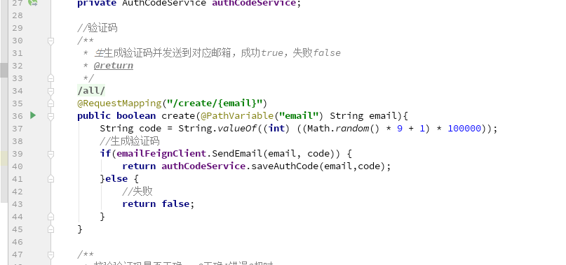

### B：存储到mysql数据库之后，使用发邮件功能，将该验证码发送到所输⼊入的邮箱地址中
#### 相关代码
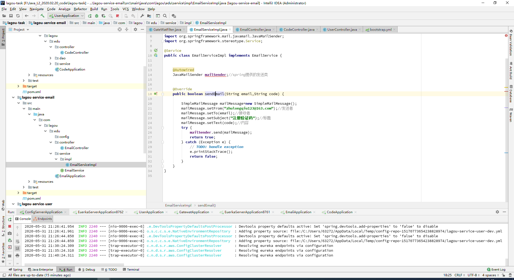

### C：用户从邮箱中拿到验证码，点击注册时，需要进行校验，因为验证码已经存入数据库，此时只需要查询数据库中该邮箱地址对应的最近⼀一次的验证码记录，校验验证码是否正确，是否超时，若有问题，准确提示给用户
#### 相关代码
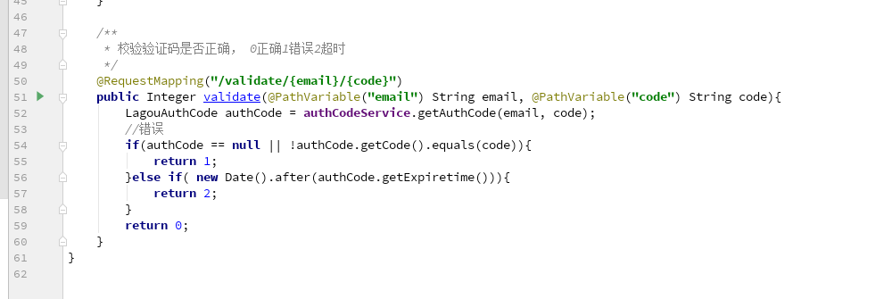

### 4）注册成功后，根据 <用户邮箱+密码> 生成签发token令牌（此处生成⼀一个UUID模拟即可）， 该token令牌存入数据库（因为⼤大家未系统学习Redis，所以此处令牌存⼊入数据库即可） ，并写入cookie中（以后的每次请求都会在cookie中携带该token，网关过滤器器通过验证token的合法性来确定用户请求是否合法，如果token合法，根据token取出⽤用户信息---->邮箱），最后重定向到欢迎页面（显示邮箱地址）
#### 相关代码
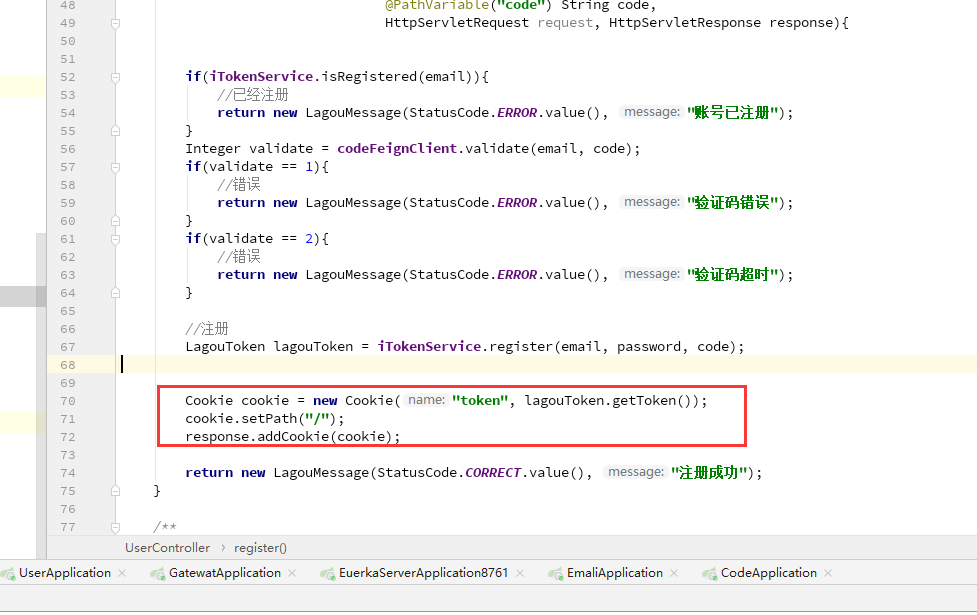

### 登录1）用户访问登录页面，在登录页面输⼊入邮箱地址+密码
### 2）点击登录，后台对用户名和密码进行验证，然后根据<用户邮箱+密码> 生成签发token令牌（此处生成⼀一个UUID模拟即可）， 该token令牌存⼊入数据库（因为大家未系统学习Redis，所以此处令牌存入数据库即可） ，并写入cookie中（以后的每次请求都会在cookie中携带该token，⽹网关过滤器器通过验证token的合法性来确定⽤用户请求是否合法，如果token合法，根据token取出⽤用户信息---->邮箱），最后重定向到欢迎⻚页⾯面（显示邮箱地址）
#### 相关代码

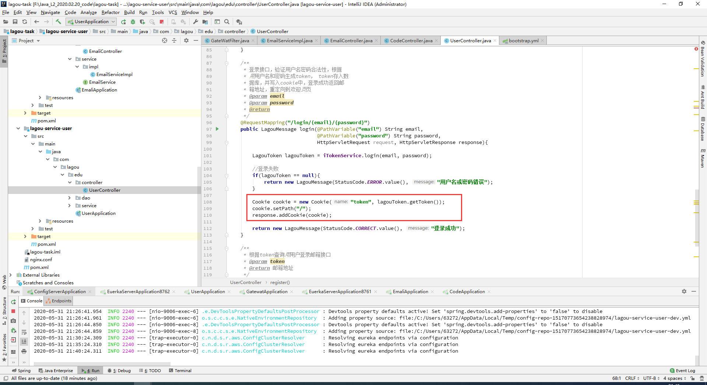

### 相关架构
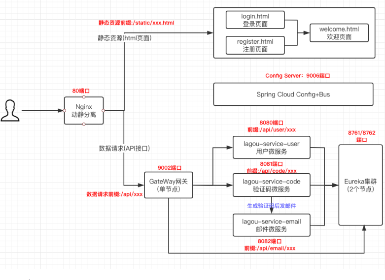

### Nginx占⽤用端⼝口： 80实现动静分离。将静态资源 html 页面存放至本地磁盘，数据请求统⼀一经过 GateWay 网关路由到下游微服务

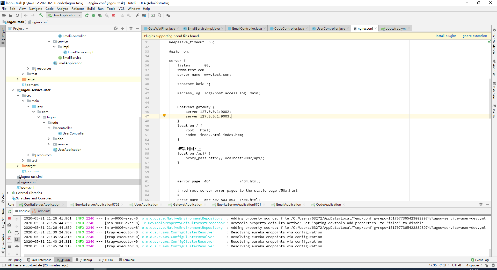

### 静态资源（html⻚页⾯面）访问前缀： /static/xxx.html包括登录页面 login.html、注册页面 register.html、以及成功登录之后的欢迎页面welcome.html，各个页面细节元素后面有描述

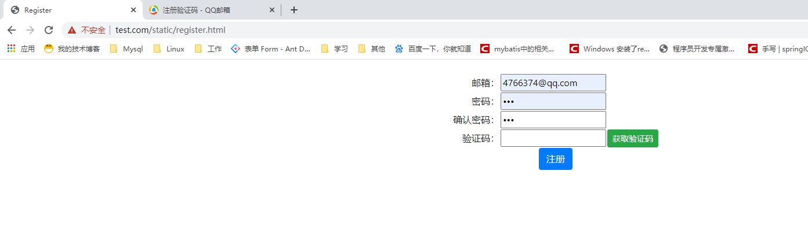

### GateWay ⽹网关占用端口： 9002端口 数据请求前缀:/api/xxx完成统一路由、 IP防暴刷（限制单个客户端IP在最近X分钟内请求注册接⼝口不不能超过Y次）、统一认证（登录时验证用户名密码是否合法，合法调用户微服务生成token，写⼊入cookie，并且携带邮箱地址重定向到欢迎⻚页⾯面；后续请求再到来时，验证客户端请求cookie中携带的token是否合法，合法则放⾏行行，此处不不考虑token更更新问题）等功能

#### IP防暴暴刷
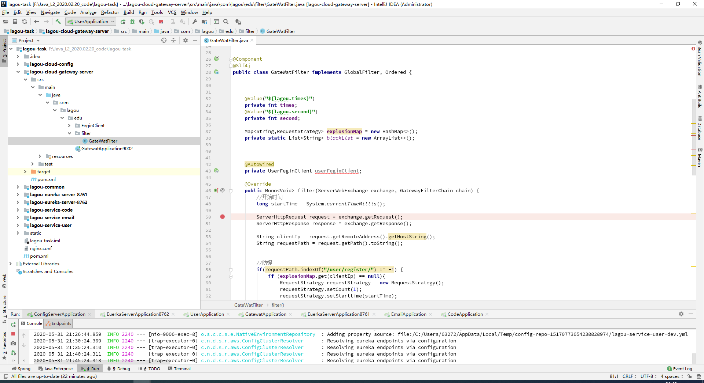
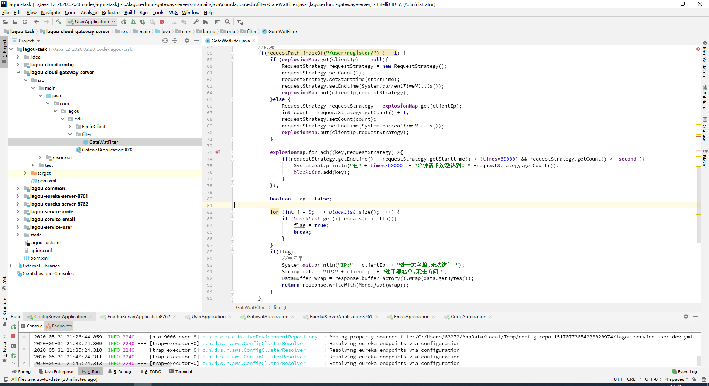

#### 统一认证
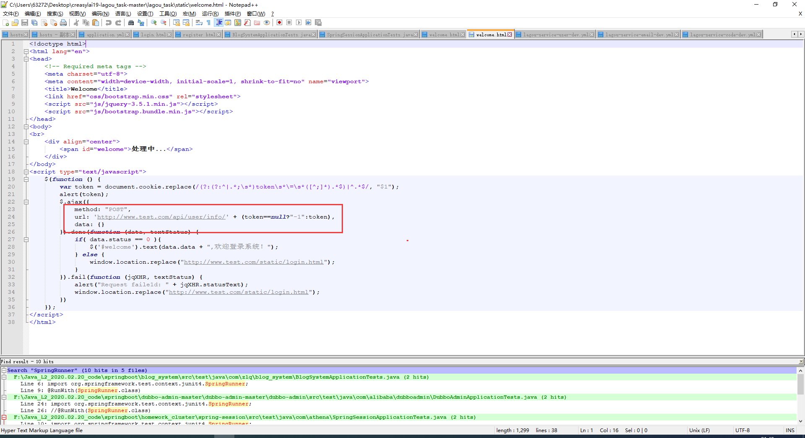
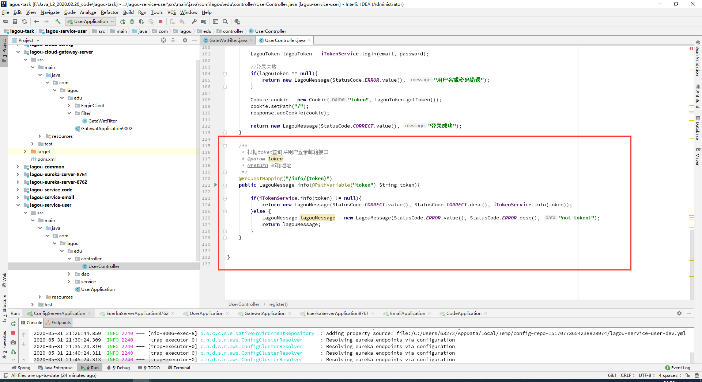

### GateWay网关
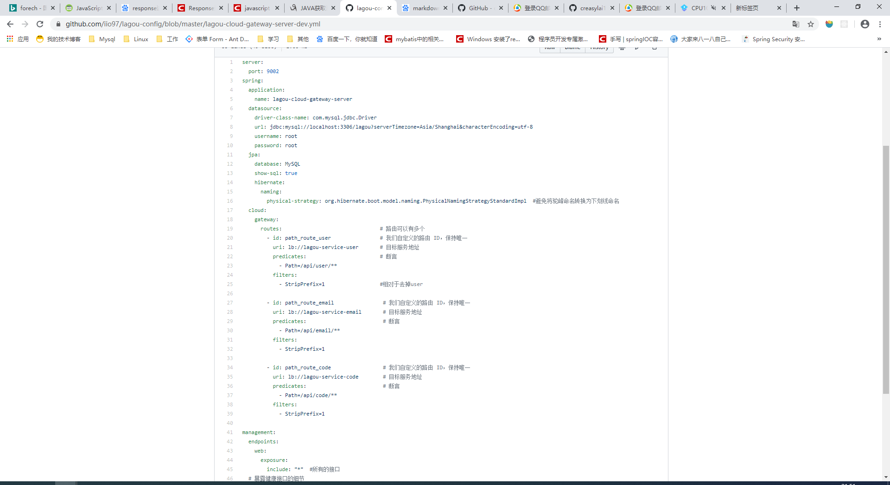
